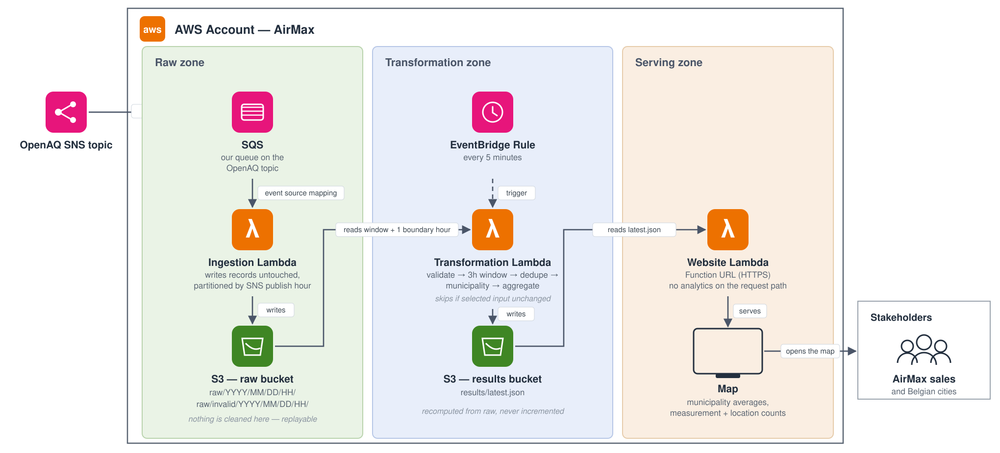

# AirMax real-time air-quality PoC

A local-first pipeline that taps the OpenAQ stream, calculates each Belgian municipality's current
air quality as the latest source-anchored three-hour average, reports the measurement evidence, and
serves a dependency-free map. Data-quality findings qualify the view; they do not replace it.

## Run locally

Requires Python 3.11+, [uv](https://docs.astral.sh/uv/), and `make`.

```sh
make install
make install-hooks # activate the versioned pre-commit hook
make replay
make replay-data # replay data/openaq-andre-raw.jsonl
make lint
make typecheck
make test
make serve       # http://localhost:8000
```

No AWS credentials are used by those commands. Generated files are under `.local/`. Repository
rules for coding agents live in `AGENTS.md`; `make pre-commit` checks Ruff, mypy and regression behavior.

For a Linux environment matching AWS Lambda, start Docker Desktop and run:

```sh
make docker-test
make docker-replay
```

## Layout

- `services/ingestion`: SQS to unchanged raw storage.
- `services/transformation`: raw storage to calculated city results.
- `services/website`: results to HTTP and the map.
- `tests`: regression checks and fixtures.
- `tools`: local replay commands.
- `infra/terraform`: AWS deployment.

Each service is an independent package and deployment artifact. See `AGENTS.md` for the repository map and authoritative documentation index.

## How it works



AirMax has three stages: **collect**, **calculate** and **show**. Each stage is a separate AWS
Lambda function, and the stages share data only through files in S3.

```text
 COLLECT                         CALCULATE                          SHOW
 ───────                         ─────────                          ────
 OpenAQ SNS topic                EventBridge rule (every 5 min)     Browser
      │                                │                               ▲
      ▼                                ▼                               │
 SQS queue                       Transformation Lambda              Website Lambda
      │                           reads raw data,                    (public HTTPS URL)
      ▼                           calculates city results              ▲
 Ingestion Lambda                      │                               │
      │                                ▼                               │
      ▼                          S3 results bucket ────────────────────┘
 S3 raw bucket ─────────────────► results/latest.json
 raw/YYYY/MM/DD/HH/
```

### Step by step

1. **OpenAQ publishes air-quality readings.** OpenAQ sends measurements from sensors to an SNS
   topic. Belgian readings arrive in bursts, not as a steady stream.
2. **A queue holds the readings.** An SQS queue subscribed to that topic keeps every message until
   AirMax has saved it, so nothing is lost if a Lambda is slow or fails.
3. **Ingestion saves the readings unchanged.** The ingestion Lambda writes each message to the raw S3
   bucket in a folder named after the hour it was published (`raw/YYYY/MM/DD/HH/`). It never edits,
   filters or deletes anything. Messages without a usable timestamp go to `raw/invalid/` instead of
   being dropped. These raw files are the permanent record that every result can be rebuilt from.
4. **Every five minutes, transformation recalculates the results.** A scheduled EventBridge rule
   starts the transformation Lambda. It checks whether any new raw files arrived and stops
   straight away if none did. Otherwise it:
   - reads the raw files for the recent time window;
   - drops readings that are invalid or outside Belgium;
   - removes duplicate readings;
   - finds the Belgian municipality each sensor is in;
   - calculates each municipality's average per pollutant for the last 3 hours, plus WHO
     comparison averages (24 hours, or 8 hours for ozone).

   The time window ends at the **newest reading received**, not at the current clock time, so the
   map still shows the latest burst of data during quiet periods.
5. **The results are saved as one file.** Transformation writes everything to a single file,
   `results/latest.json`, in the results S3 bucket. It is recalculated from the raw data every
   time rather than updated piece by piece, so reruns and duplicate messages always give the same
   answer.
6. **The website shows the map.** The website Lambda has a public HTTPS address (a Lambda Function
   URL). It serves the map page, the municipality borders and the results from `latest.json`. It
   does no calculating when someone visits; it only passes on results that are already computed.

### The pieces

| Piece | Started by | Reads | Writes | Code |
|---|---|---|---|---|
| Ingestion Lambda | New messages on the SQS queue | SQS messages | S3 `raw/` | `services/ingestion` |
| Transformation Lambda | EventBridge rule, every 5 minutes | S3 `raw/` | S3 `results/latest.json` | `services/transformation` |
| Website Lambda | A visitor opening the URL | S3 `results/latest.json` | Nothing | `services/website` |

### Design choices

- **The three services are independent.** They never import each other's code. The only thing
  they share is the file layout in S3, so each one can be changed, tested and deployed on its own.
- **Files instead of a database.** The job needs a permanent copy of the input and one finished
  output, which S3 provides cheaply without an always-on database.
- **The same code runs on a laptop and in AWS.** All S3 access is isolated in small "adapter"
  modules. Locally, adapters use folders under `.local/` instead of S3, so `make replay` runs the
  real pipeline without an AWS account.
- **Only the website is public.** Both S3 buckets block all public access. The website Lambda
  reads the results bucket and passes the data to the browser.

The reasons behind each choice, and the trade-offs accepted, are in
[docs/architecture.md](docs/architecture.md).

## Further reading

See the human-readable [ingestion and listing rules](services/ingestion/RULES.md),
[transformation rules](services/transformation/RULES.md), [architecture](docs/architecture.md), [findings](docs/data-findings.md),
[testing strategy](docs/testing.md), and [Terraform instructions](infra/terraform/README.md).

## AWS setup

Copy the committed template, fill in your own credentials and account ID, then verify access:

```powershell
Copy-Item .env.example .env
.\with-env.ps1 aws sts get-caller-identity
```

`.env` is ignored by Git. Never put real credentials in `.env.example`.

## Deploy

See the step-by-step [Terraform instructions](infra/terraform/README.md).
